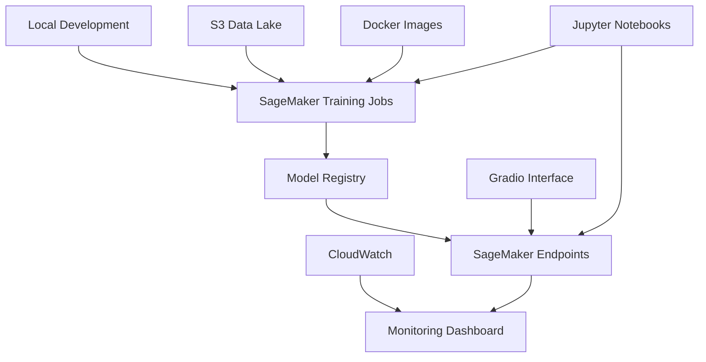

# AWS SageMaker Integration for Stranger Things NLP Project

## Overview

This document provides a comprehensive guide to the AWS SageMaker integration for the Stranger Things NLP project. The integration enables scalable, production-ready machine learning workflows for training and deploying character chatbots, text classifiers, and NLP analysis tools using AWS's managed ML infrastructure.

## Table of Contents

- [Architecture Overview](#architecture-overview)
- [Key Features](#key-features)
- [Project Structure](#project-structure)
- [Quick Start](#quick-start)
- [Detailed Setup](#detailed-setup)
- [Components Overview](#components-overview)
- [Usage Examples](#usage-examples)
- [Monitoring & Cost Management](#monitoring--cost-management)
- [Migration from EC2](#migration-from-ec2)
- [Best Practices](#best-practices)
- [Troubleshooting](#troubleshooting)
- [Contributing](#contributing)

## Architecture Overview

The SageMaker integration transforms the existing local/EC2-based NLP pipeline into a cloud-native, scalable ML platform:



### Data Flow Architecture

1. **Data Ingestion**: Raw subtitle files (.srt) → S3 storage
2. **Training Pipeline**: SageMaker Training Jobs with custom Docker containers
3. **Model Management**: Automatic model versioning and registry
4. **Deployment**: Real-time and batch inference endpoints
5. **Monitoring**: CloudWatch metrics, logs, and custom dashboards

## Key Features

### **Scalable ML Training**
- **Distributed Training**: Multi-GPU, multi-instance training for large language models
- **Spot Instance Support**: Cost-effective training with automatic spot instance management
- **Custom Docker Containers**: Optimized environments for PyTorch, HuggingFace Transformers
- **Hyperparameter Tuning**: Automated optimization of model parameters

### **Production-Ready Deployment**
- **Real-time Inference**: Low-latency endpoints for interactive chatbots
- **Batch Processing**: Efficient bulk text processing and analysis
- **Auto-scaling**: Dynamic scaling based on traffic patterns
- **A/B Testing**: Safe model deployment with traffic splitting

### **Enterprise Monitoring**
- **CloudWatch Integration**: Comprehensive metrics and logging
- **Custom Dashboards**: Real-time performance monitoring
- **Cost Tracking**: Detailed cost analysis and optimization recommendations
- **Alert Management**: Proactive issue detection and notification

### **Security & Compliance**
- **VPC Integration**: Secure network isolation
- **IAM Role Management**: Fine-grained access control
- **Data Encryption**: End-to-end encryption for data and models
- **Audit Logging**: Comprehensive activity tracking

## Project Structure

```
project/
├── sagemaker/                          # SageMaker integration package
│   ├── __init__.py                     # Package initialization
│   ├── README.md                       # Detailed module documentation
│   ├── config.py                       # Configuration management
│   ├── training_orchestrator.py        # Training job orchestration
│   ├── deployment_manager.py           # Model deployment management
│   ├── storage.py                      # S3 data management
│   ├── monitoring.py                   # CloudWatch monitoring
│   ├── gradio_app.py                   # SageMaker-enabled web interface
│   ├── deploy.py                       # CLI deployment tool
│   ├── docker/                         # Custom container definitions
│   │   ├── Dockerfile                  # Training container image
│   │   └── build_and_push.sh          # Container build script
│   └── examples/                       # Tutorials and examples
│       └── stranger_things_sagemaker_tutorial.ipynb
├── aws_infrastructure/                 # Existing AWS utilities
│   ├── ec2_manager.py                  # EC2 instance management
│   └── s3_manager.py                   # S3 operations
├── character_chatbot/                  # Core chatbot implementations
├── theme_classifier/                   # Theme analysis tools
├── character_network/                  # Network analysis
├── text_classification/                # Location classification
├── utils/                             # Shared utilities
├── gradio_app.py                      # Original local interface
├── requirements.txt                   # Dependencies
├── WARP.md                           # Development guide
└── SAGEMAKER_INTEGRATION.md          # This document
```

## Quick Start

### Prerequisites
- AWS Account with SageMaker access
- AWS CLI configured with appropriate permissions
- Docker installed (for custom containers)
- Python 3.9+ with required dependencies

### 1. Environment Setup

```bash
# Clone and navigate to project
cd /path/to/stranger-things-nlp

# Install dependencies
pip install -r requirements.txt

# Set up AWS credentials
aws configure

# Set environment variables
export HUGGINGFACE_TOKEN="your_hf_token"
export AWS_DEFAULT_REGION="us-east-1"
```

### 2. Initialize SageMaker Infrastructure

```bash
# Build and push custom training container
cd sagemaker/docker
./build_and_push.sh

# Deploy infrastructure and start training
cd ..
python deploy.py --setup-infrastructure --train-all --deploy-all
```

### 3. Launch the Application

```bash
# Run SageMaker-enabled Gradio interface
python sagemaker/gradio_app.py
```

### 4. Monitor and Manage

```bash
# Check training job status
python deploy.py --status

# View cost analysis
python deploy.py --cost-analysis

# Clean up resources
python deploy.py --cleanup
```

## Detailed Setup

### AWS Permissions Setup

Create an IAM role with the following policies:
- `AmazonSageMakerFullAccess`
- `AmazonS3FullAccess`
- `AmazonEC2ContainerRegistryFullAccess`
- `CloudWatchFullAccess`

### Custom Training Container

The project uses a custom Docker container optimized for NLP workloads:

```dockerfile
# Key components included:
- PyTorch with CUDA support
- HuggingFace Transformers
- SpaCy with language models
- AWS SDK for Python
- Custom training scripts
```

### Configuration Management

The `config.py` module provides centralized configuration:

```python
from sagemaker.config import SageMakerConfig, TrainingConfig, DeploymentConfig

# Initialize with your settings
config = SageMakerConfig(
    region='us-east-1',
    role_arn='arn:aws:iam::YOUR_ACCOUNT:role/SageMakerRole',
    bucket_name='your-sagemaker-bucket'
)
```

## Components Overview

### Training Orchestrator (`training_orchestrator.py`)
- **Purpose**: Manages the complete training lifecycle
- **Features**: Data preparation, job launching, monitoring, model registration
- **Models Supported**: Llama chatbots, Qwen chatbots, text classifiers, theme analyzers

### Deployment Manager (`deployment_manager.py`)
- **Purpose**: Handles model deployment and endpoint management
- **Features**: Real-time endpoints, batch transforms, auto-scaling, A/B testing
- **Deployment Types**: Single model, multi-model, serverless inference

### Storage Manager (`storage.py`)
- **Purpose**: S3 data and model artifact management
- **Features**: Efficient uploads/downloads, versioning, lifecycle policies
- **Data Types**: Training data, model artifacts, inference results

### Monitoring System (`monitoring.py`)
- **Purpose**: Comprehensive observability and cost tracking
- **Features**: Custom dashboards, automated alerts, cost optimization
- **Metrics**: Inference latency, throughput, error rates, costs

### SageMaker Gradio App (`gradio_app.py`)
- **Purpose**: Web interface for SageMaker-deployed models
- **Features**: Real-time inference, batch processing, model switching
- **Components**: Character chatbots, text classification, theme analysis

## Usage Examples

### Training a Character Chatbot

```python
from sagemaker import TrainingOrchestrator, SageMakerConfig

# Initialize orchestrator
config = SageMakerConfig()
orchestrator = TrainingOrchestrator(config)

# Start training job
job_name = orchestrator.train_chatbot(
    model_type='llama',
    character='eleven',
    instance_type='ml.g4dn.xlarge',
    spot_instances=True
)

# Monitor progress
status = orchestrator.get_training_status(job_name)
print(f"Training status: {status}")
```

### Deploying Models

```python
from sagemaker import DeploymentManager

# Initialize deployment manager
deployment_manager = DeploymentManager(config)

# Deploy chatbot endpoint
endpoint_name = deployment_manager.deploy_chatbot(
    model_name='eleven-chatbot-v1',
    instance_type='ml.m5.large',
    initial_instance_count=1,
    auto_scaling_enabled=True
)

# Test inference
response = deployment_manager.invoke_endpoint(
    endpoint_name=endpoint_name,
    input_data={"message": "Hello, how are you?"}
)
```

### Batch Processing

```python
# Create batch transform job
transform_job = deployment_manager.create_batch_transform(
    model_name='text-classifier-v1',
    input_path='s3://bucket/input-data/',
    output_path='s3://bucket/output-results/',
    instance_type='ml.m5.xlarge'
)
```

### Monitoring and Alerts

```python
from sagemaker import SageMakerMonitor

monitor = SageMakerMonitor(config)

# Create custom dashboard
dashboard = monitor.create_dashboard([
    'chatbot-endpoint',
    'text-classifier-endpoint'
])

# Set up cost alerts
monitor.setup_cost_alerts(
    threshold_usd=100,
    notification_email='admin@company.com'
)
```

## Monitoring & Cost Management

### CloudWatch Dashboards

The integration automatically creates comprehensive dashboards:

- **Training Metrics**: Job duration, resource utilization, convergence plots
- **Inference Metrics**: Latency, throughput, error rates, concurrent requests
- **Cost Metrics**: Training costs, inference costs, storage costs, trends

### Cost Optimization Features

1. **Spot Instance Training**: Up to 70% cost reduction
2. **Auto-scaling Endpoints**: Pay only for active usage
3. **Batch Transform**: Cost-effective bulk processing
4. **Model Compression**: Reduced inference costs
5. **Scheduled Scaling**: Automatic endpoint scaling

### Alert Management

```python
# Example alert configurations
alerts = [
    {
        'metric': 'ModelLatency',
        'threshold': 1000,  # milliseconds
        'comparison': 'GreaterThanThreshold'
    },
    {
        'metric': 'InvocationErrors',
        'threshold': 5,  # errors per minute
        'comparison': 'GreaterThanThreshold'
    }
]
```

## Migration from EC2

### Current EC2 Architecture → SageMaker Benefits

| **Aspect** | **EC2 (Current)** | **SageMaker (New)** |
|------------|-------------------|---------------------|
| **Scaling** | Manual instance management | Automatic scaling |
| **Cost** | Always-on instances | Pay-per-use |
| **Maintenance** | Manual updates/patches | Managed service |
| **Monitoring** | Custom CloudWatch setup | Built-in monitoring |
| **Model Deployment** | Custom Docker/K8s | Managed endpoints |
| **Training** | Single-instance | Distributed training |

### Migration Steps

1. **Phase 1**: Set up SageMaker infrastructure alongside existing EC2
2. **Phase 2**: Migrate training workloads to SageMaker
3. **Phase 3**: Deploy models to SageMaker endpoints
4. **Phase 4**: Update Gradio interface to use SageMaker endpoints
5. **Phase 5**: Decommission EC2 resources

### Data Migration

```bash
# Copy existing model artifacts to S3
aws s3 sync ./models/ s3://your-bucket/models/

# Migrate training data
aws s3 sync ./data/ s3://your-bucket/data/
```

## Best Practices

### **Architecture**
- Use VPC endpoints for secure S3 access
- Implement proper IAM roles and policies
- Enable encryption at rest and in transit
- Use multiple availability zones for high availability

### **Cost Optimization**
- Use spot instances for non-critical training
- Implement auto-scaling for endpoints
- Schedule endpoint scaling for predictable traffic
- Monitor and set up cost alerts

### **Monitoring**
- Set up comprehensive CloudWatch dashboards
- Implement custom metrics for business KPIs
- Use AWS X-Ray for distributed tracing
- Set up automated alerting for anomalies

### **Security**
- Use VPC for network isolation
- Implement least-privilege IAM policies
- Enable CloudTrail for audit logging
- Regularly rotate access keys

### **Performance**
- Choose appropriate instance types for workloads
- Optimize model inference with TensorRT/ONNX
- Use multi-model endpoints for cost efficiency
- Implement caching for frequent requests

## Troubleshooting

### Common Issues and Solutions

#### Training Job Failures
```bash
# Check training job logs
python deploy.py --logs --job-name your-training-job

# Common solutions:
# - Verify IAM permissions
# - Check Docker image availability
# - Validate input data format
# - Review resource limits
```

#### Endpoint Errors
```bash
# Check endpoint status and logs
python deploy.py --endpoint-status --endpoint-name your-endpoint

# Common solutions:
# - Verify model artifacts
# - Check instance capacity
# - Review security group settings
# - Validate inference code
```

#### High Costs
```bash
# Analyze cost breakdown
python deploy.py --cost-analysis --days 30

# Cost reduction strategies:
# - Use spot instances for training
# - Implement auto-scaling
# - Delete unused endpoints
# - Optimize model size
```

#### Performance Issues
- **High Latency**: Scale up instance types, enable auto-scaling
- **Low Throughput**: Use multi-model endpoints, implement caching
- **Memory Issues**: Optimize model size, use larger instances

### Debug Mode

Enable detailed logging for troubleshooting:

```python
import logging
logging.basicConfig(level=logging.DEBUG)

# Run commands with verbose output
python deploy.py --verbose --debug
```

## Contributing

### Development Workflow

1. **Fork the repository**
2. **Create a feature branch**
3. **Implement changes with tests**
4. **Update documentation**
5. **Submit pull request**

### Testing

```bash
# Run unit tests
pytest sagemaker/tests/

# Run integration tests
pytest sagemaker/tests/integration/

# Test deployment pipeline
python sagemaker/tests/test_deployment.py
```

### Documentation

- Update docstrings for new functions
- Add examples for new features
- Update this README for architectural changes
- Include performance benchmarks

### Code Standards

- Follow PEP 8 style guidelines
- Use type hints for function signatures
- Include comprehensive error handling
- Add logging for debugging

## Additional Resources

### Documentation Links
- [AWS SageMaker Documentation](https://docs.aws.amazon.com/sagemaker/)
- [SageMaker Python SDK](https://sagemaker.readthedocs.io/)
- [HuggingFace SageMaker Integration](https://huggingface.co/docs/sagemaker/)

### Example Notebooks
- `sagemaker/examples/stranger_things_sagemaker_tutorial.ipynb`
- AWS SageMaker Example Notebooks
- HuggingFace SageMaker Examples

### Support Channels
- GitHub Issues for bug reports
- AWS SageMaker Forums for platform issues
- HuggingFace Forums for model-specific questions

---

## Conclusion

The AWS SageMaker integration transforms the Stranger Things NLP project into a scalable, production-ready ML platform. With automated training, managed deployments, comprehensive monitoring, and cost optimization, teams can focus on developing better models while AWS handles the infrastructure complexity.

For detailed implementation guides, see the module-specific documentation in `sagemaker/README.md` and the comprehensive tutorial notebook in `sagemaker/examples/`.

**Happy ML Engineering!**

---

*Last Updated: September 2024*
*Version: 1.0.0*